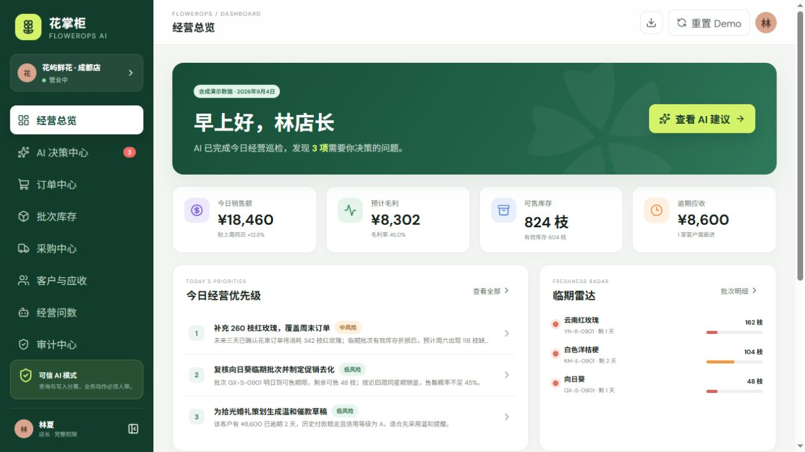
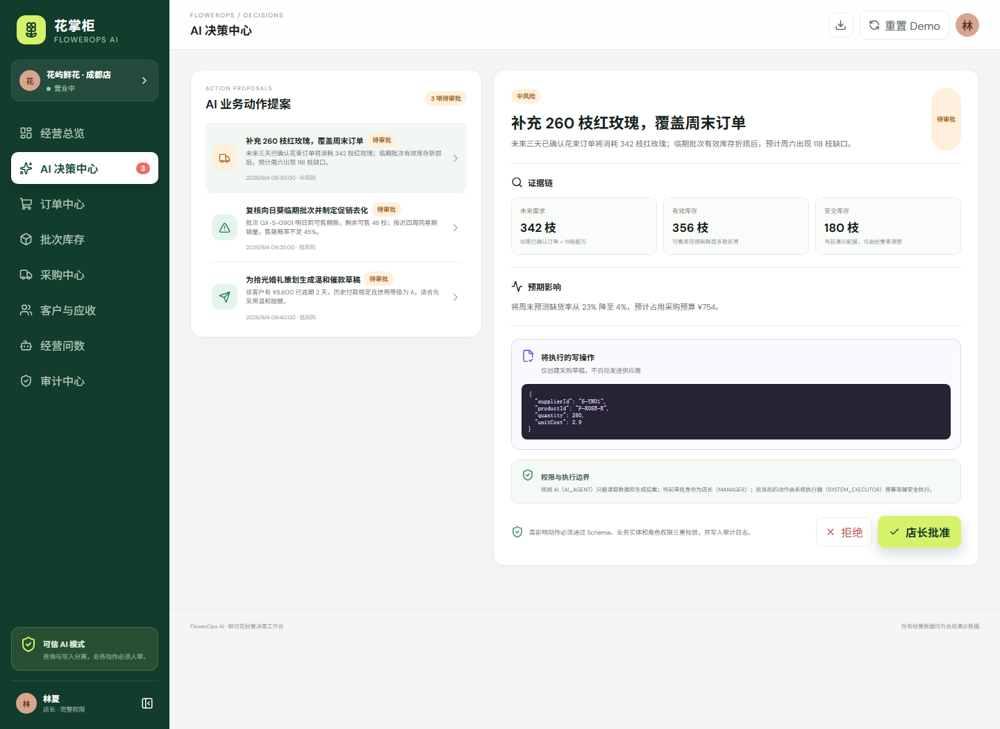
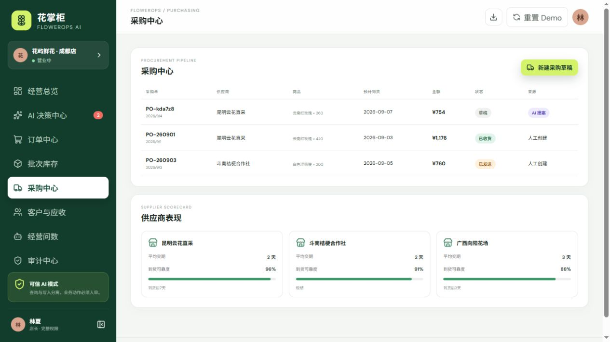
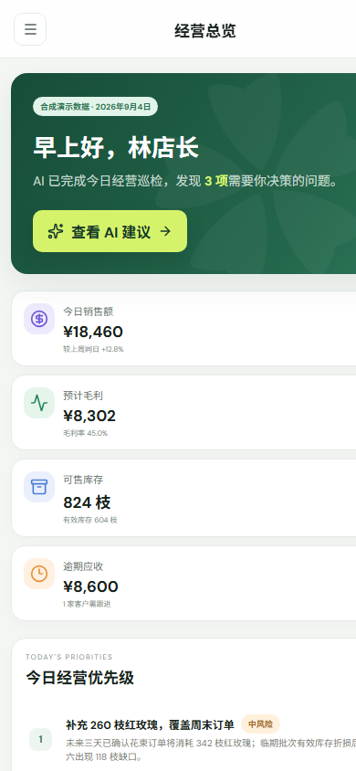

# 花掌柜 FlowerOps AI

> 面向鲜切花批发、社区花店与花艺工作室的可解释 AI 经营决策工作台。

   

## 项目截图







### 移动端



## 项目定位

FlowerOps 不是“接一个大模型接口的聊天机器人”，而是一个用于 AI 产品经理作品集的完整业务系统原型。它把订单、花束配方、批次库存、采购、客户与应收等经营事实串联起来，让 AI 发现问题、展示证据、生成业务动作提案，并通过人工审批、幂等执行与审计完成安全闭环。

```text
经营事实 → 异常发现 → 可解释诊断 → AI 动作提案
→ 策略校验 → 人工审批 → 安全执行 → 审计与经营复盘
```

## 在线演示的核心路径

1. 进入 **经营总览**，查看临期库存、预测缺货和逾期应收。
2. 打开 **AI 决策中心**，选择“补充 260 枝红玫瑰”。
3. 核对证据链、预期影响和即将执行的写操作。
4. 点击“批准提案”，再点击“安全执行”。
5. 进入 **采购中心**，确认系统只创建了采购草稿，没有自动发送供应商。
6. 进入 **审计中心**，查看审批人、请求 ID、幂等键与执行结果。

## 产品与面试材料

- [产品需求文档 PRD](docs/PRD.md)
- [系统架构与数据流](docs/architecture.md)
- [AI 权限与安全边界](docs/AI-boundary.md)
- [43 条测试与评测方案](docs/evaluation.md)
- [AI 产品经理面试讲解脚本](docs/interview-story.md)
## 已实现功能

- 经营总览：销售额、毛利、批次库存、应收与异常优先级
- AI 决策中心：证据链、风险、预期影响、Schema 校验、角色审批、拒绝和幂等执行
- 订单中心：多来源订单、履约状态、花束配方说明
- 批次库存：在库、预留、冻结、过期、可售、新鲜度与库存流水
- 采购中心：AI 采购草稿、供应商交期与可靠度
- 客户与应收：信用额度、账期、逾期和信用占用
- 经营问数：固定只读模板、数据依据和结果边界
- 审计中心：状态前后、执行主体、Request ID 与 Idempotency Key
- localStorage 持久化、Demo 重置和 JSON 数据导出
- 采购、订单、应收与批次库存状态机，阻止跳级和反向流转
- AI_AGENT、店长、采购、财务、仓管与系统执行器权限矩阵
- 43 条领域规则与治理测试，无 API Key 可完整演示

## AI 权限边界

AI 可以查询、聚合、解释、预测并创建草稿，但不能自行：

- 直接覆盖库存余额或删除库存流水
- 自动确认采购或发送供应商
- 自动发送催款消息
- 将未收款标为已收
- 自动调价、退款、报损、核销坏账
- 跳过人工审批或修改角色权限

详细规则见 [docs/AI-boundary.md](docs/AI-boundary.md)。

## 核心业务公式

```text
可售库存 = 在库 - 已预留 - 质量冻结 - 已过期
有效库存 = Σ(批次可售量 × 新鲜度系数)
建议采购量 = max(0, 交期内预测需求 + 安全库存 - 可售库存 - 已确认在途)
```

新鲜度系数为透明、可配置的 MVP 演示规则，不宣称为行业标准。

## 本地运行

```bash
npm install
npm run dev
```

质量门槛：

```bash
npm run lint
npm test
npm run build
```

## 部署

### Vercel

直接导入本仓库。Framework Preset 选择 Vite，Build Command 使用 `npm run build`，Output Directory 使用 `dist`。

### GitHub Pages

仓库已使用相对资源路径 `base: './'`，可将 `dist` 目录交给 GitHub Pages Action 发布。CI 配置位于 `.github/workflows/ci.yml`。

## 项目结构

```text
src/domain/types.ts       领域实体与状态
src/domain/engine.ts      库存、预测、校验、审批、执行与问数规则
src/domain/proposals.ts   四类 AI 动作提案的 Zod Schema
src/domain/permissions.ts 角色权限矩阵与最小权限规则
src/domain/workflow.ts    订单、采购、应收和批次状态机
src/data/demoData.ts      明确标注的合成演示数据
src/storage/repository.ts localStorage 与 JSON 导出
src/tests/engine.test.ts  库存、预测与幂等执行测试
src/tests/governance.test.ts 权限、提案校验和状态机测试
src/App.tsx               八个业务页面与交互闭环
docs/                     PRD、架构、AI 边界与评测方案
```

## 数据声明

仓库中的商家、客户、供应商、订单、金额和经营结果均为合成演示数据，只用于产品设计和技术验证，不代表任何真实企业经营情况。

## License

MIT
