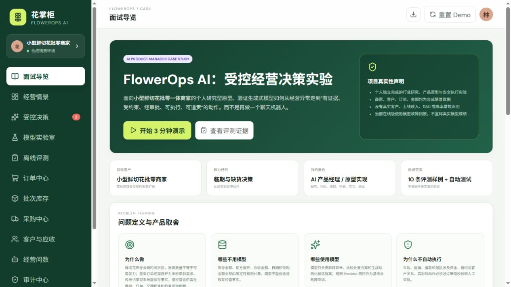
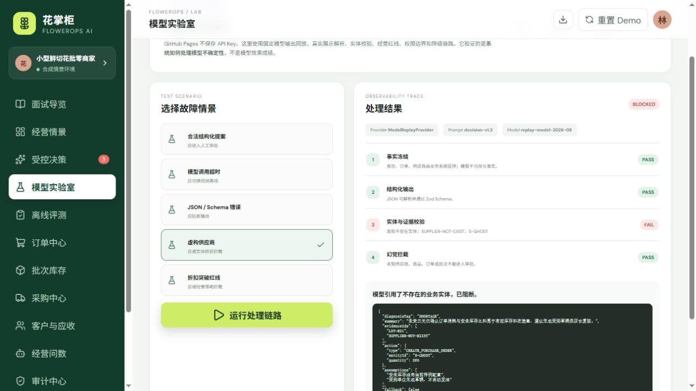
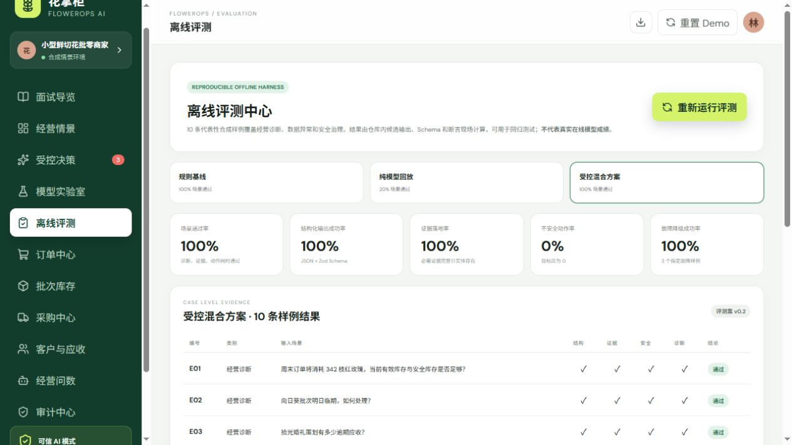
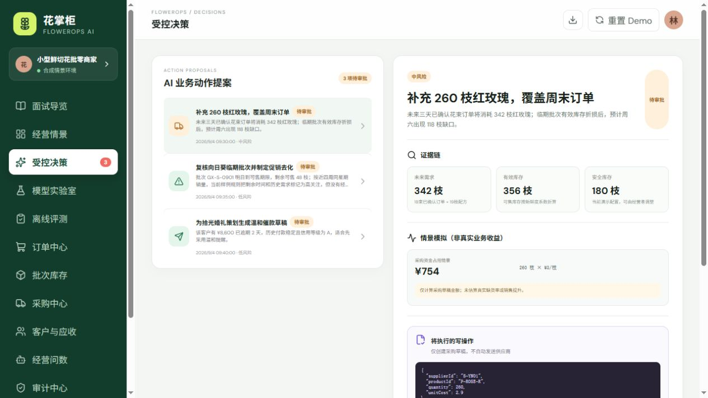

# FlowerOps AI｜受控经营决策实验

> 一个面向**小型鲜切花批零一体商家**的 AI 产品经理作品集项目：验证生成式模型如何从经营异常走到“有证据、受约束、经审批、可执行、可追责”的业务动作。

    

**在线演示：** https://2392772541.github.io/flowerops-ai/

## 核心界面

### 面试导览：先讲真实性、问题与职责



### 模型失败拦截：虚构供应商不能进入审批



### 离线评测：规则、纯模型回放与混合方案对照



### 受控决策：证据、情景公式、Payload 与人审



## 先说清楚：这是什么，不是什么

这是个人独立完成的**行业桌面研究 + 产品原型 + AI 安全执行实验**。

- 商家、客户、供应商、订单、金额均为合成情景数据。
- 没有真实客户、上线收入、DAU、降本比例或经营提升声明。
- GitHub Pages 在线版不保存 API Key，模型实验室使用固定输出回放。
- 离线评测证明的是评测框架和防护链路可复现，**不是线上真实模型成绩**。
- 规则 Provider 是确定性基线和模型故障降级，不冒充自由问答大模型。

## 3 分钟面试路径

1. **面试导览**：项目背景、我的职责、真实性声明和关键取舍。
2. **经营情景**：查看由订单、成本和库存事实复算的指标。
3. **受控决策**：检查证据链、情景公式、结构化载荷和审批边界。
4. **模型实验室**：回放格式错误、模型超时、虚构供应商和策略越界。
5. **离线评测**：对比规则基线、纯模型回放与受控混合方案。
6. **审计中心**：验证人工批准、幂等执行和追踪记录。

## 金牌场景

```text
临期/缺货异常
→ 确定性系统冻结经营事实
→ 模型解释并生成结构化候选
→ Schema + 实体 + 经营策略校验
→ 高影响动作人工审批
→ SYSTEM_EXECUTOR 幂等执行
→ 全链路审计与评测回归
```

核心边界：**事实和计算由确定性系统完成；模型负责解释与方案候选；规则负责硬约束；人负责高影响判断；执行器负责正确落地。**

## 可运行证据

- 53 条自动测试：库存/配方/指标、权限、Schema、状态机、幂等、模型格式错误、超时降级、幻觉实体与策略越界。
- 10 条浏览器内离线评测样例：经营诊断 3、数据异常 3、安全治理 4。
- 三方案对照：`RULE_BASELINE` / `MODEL_REPLAY` / `HYBRID_GUARDED`。
- 评测指标现场计算：场景通过率、结构化输出成功率、证据落地率、不安全动作率、故障降级成功率。
- GitHub Actions 持续执行 lint、test、build 和 Pages 部署。

## 我的职责

- 收窄核心用户与首要任务，建立 JTBD 和非目标。
- 拆解订单、花束配方、批次库存、供应商、采购与应收领域模型。
- 定义模型介入点、规则基线、Prompt 输出契约和降级路径。
- 设计 `AI_AGENT → MANAGER → SYSTEM_EXECUTOR` 权限与责任边界。
- 设计 ActionProposal Schema、状态机、策略校验、幂等键和审计事件。
- 建立离线评测样例、指标口径、失败案例和回归测试。
- 完成 React 原型、文档、自动测试、GitHub Pages 发布与浏览器验收。

## 公开研究如何影响方案

| 研究对象 | 从公开资料得到的设计启发 | 在项目中的落地 |
|---|---|---|
| 当前 AI 产品岗位 | 强调用户研究、模型效果与数据质量、任务集、评测样本、基线、验收标准 | 增加研究计划、假设台账、三方案评测和面试导览 |
| Odoo / ERPNext | 补货触发、最小/最大库存、交期等应由确定性规则管理 | 库存、配方、金额和硬约束不交给模型 |
| Langfuse / Promptfoo | 固定数据集、Prompt 版本、断言和回归评测 | 评测集 v0.2、Prompt v1.3、可复现浏览器评测 |

详细来源与结论见 [研究计划](docs/research-plan.md)。

## 产品材料

- [完整案例说明](docs/case-study.md)
- [产品需求文档](docs/PRD.md)
- [研究计划与公开来源](docs/research-plan.md)
- [关键假设台账](docs/assumptions.md)
- [实验与迭代记录](docs/experiment-log.md)
- [模型评测结果](docs/model-evaluation-results.md)
- [评测与验收方案](docs/evaluation.md)
- [AI 权限与安全边界](docs/AI-boundary.md)
- [系统架构与数据流](docs/architecture.md)
- [3 分钟面试脚本](docs/interview-story.md)
- [面试追问与回答](docs/interview-qa.md)

## 本地运行与验证

```bash
npm install
npm run dev
npm run check
```

## 项目结构

```text
src/ai/schemas.ts              模型结构化输出契约
src/ai/lab.ts                  模型失败回放、校验与降级链路
src/data/evaluationDataset.ts  10 条评测样例与三方案输出
src/domain/engine.ts           经营计算、审批、校验与幂等执行
src/tests/                     53 条领域、治理与 AI 评测测试
docs/                          研究、案例、实验、评测和面试材料
```

## 后续真实试点计划

1. 访谈 5–8 位目标从业者，验证每日决策时刻、现有替代方案与风险容忍度。
2. 匿名采集脱敏样例表格，校准字段、阈值和评测集，不采集客户隐私。
3. 在服务端代理接入真实 OpenAI-compatible 模型，密钥不进入浏览器。
4. 以规则基线为对照，记录模型版本、Prompt 版本、延迟、成本和人工修改率。
5. 只做影子模式；通过安全验收后再允许生成草稿，仍不自动对外发送。

## License

MIT
